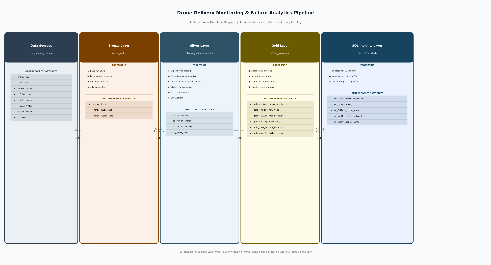

# Drone Delivery Monitoring & Failure Analytics Pipeline

A production-style data engineering pipeline built on Azure Databricks that ingests drone delivery telemetry, processes it through a Medallion Architecture, and produces operational KPIs and SQL-driven insights for fleet management.

Built as the capstone project for the **Celebal Summer Internship 2026 — Data Engineering**.


---

## Overview

The pipeline monitors a simulated fleet of 100 drones across 5,000 deliveries and 30,000 flight log entries spanning 6 months of operations. It answers five core operational questions:

- Which drones are most and least reliable?
- What is causing delivery failures — battery, signal, or weather?
- Which routes are slowest and carry the most traffic?
- Which drones use battery most efficiently per kilometre?
- Which destination zones have consistently high failure rates?

Raw CSV data flows through Bronze (ingestion), Silver (transformation), and Gold (aggregation) Delta Lake layers before being consumed by a SQL Insights layer that produces cross-KPI analysis and reusable Unity Catalog views.

---

## Architecture



---

## Dataset

No suitable public dataset exists that covers the three-table structure this pipeline requires. The dataset was simulated using Python with realistic distributions, seasonal weather patterns, and deliberate data quality issues.

| File | Rows | Description |
|------|------|-------------|
| `drones.csv` | 100 | Drone fleet dimension — drone_id, model, max_range_km |
| `deliveries.csv` | 5,000 | Delivery transactions — source, destination, distance, timestamps, status |
| `flight_logs.csv` | 30,150 | Telemetry logs — battery_level, gps_signal, weather_condition, status (includes 150 injected duplicates) |
| `drones_update.csv` | 5 | Recalibrated drone specs for SCD Type 1 MERGE demonstration |

**Simulation design choices:**
- 18% overall failure rate with seasonal variation — more failures in winter months (Dec–Feb)
- Battery drains progressively across 6 log entries per delivery, proportional to distance
- Nulls injected at 1–3% per column to create realistic data quality issues for Silver to handle
- Failure causes distributed as Battery 40% / Signal 30% / Weather 20% / Unknown 10%

---

## Pipeline Layers

### Bronze — Raw Ingestion
Reads CSVs from a Unity Catalog Volume, adds `ingestion_time` and `source_file` metadata columns, deduplicates on primary keys (notably removing 150 injected duplicates from flight_logs), and writes three Delta tables. No values are modified — Bronze lands data exactly as received.

### Silver — Cleaning & Transformation
Enforces explicit types, fills nulls using median (numeric) and mode (categorical) strategies, and derives new columns. The most significant transformation is threshold-based failure classification applied to flight_logs:

| Condition | Assigned Cause |
|-----------|---------------|
| `battery_level < 20` | `FAILED_BATTERY` |
| `gps_signal < 0.30` | `FAILED_SIGNAL` |
| `weather_condition IN (heavy_rain, storm)` | `FAILED_WEATHER` |
| None triggered | `UNKNOWN_FAILURE` |

Priority order: Battery → Signal → Weather → Unknown. A SCD Type 1 MERGE runs on `silver_drones` to handle recalibrated drone specs. All null-fill operations are logged to a `dq_audit_log` Delta table as a permanent audit trail.

### Gold — KPI Aggregations
Aggregates Silver data into six business KPI tables — one per operational metric. Reads from Silver Delta tables only, never from raw sources. The battery efficiency KPI derives battery consumed as `max(battery_level) - min(battery_level)` per delivery from flight logs, avoiding the need for an explicit battery_consumed column in the source data.

### SQL Insights — Cross-KPI Analysis
Ten SQL queries run against Gold tables and Unity Catalog views, grouped into four themes: fleet reliability, route performance, failure analysis, and operational efficiency. Four reusable views are created as a stable abstraction layer for downstream BI consumption. Notably, Insight 10 (failure timing analysis) independently corroborates KPI 3's finding that battery exhaustion is the primary failure cause — two separate layers pointing to the same root cause without directly referencing each other.

---

## KPIs Produced

| Gold Table | Business Question Answered |
|-----------|---------------------------|
| `gold_delivery_success_rate` | Which drones need maintenance? |
| `gold_avg_delivery_time` | Which routes need faster drones? |
| `gold_failure_rate_by_cause` | Where should maintenance budget go? |
| `gold_battery_efficiency` | Which drones are most cost-effective? |
| `gold_zone_failure_hotspots` | Which delivery zones are highest risk? |
| `gold_monthly_failure_trend` | Is fleet reliability improving over time? |

---

## Key Design Decisions

**Threshold-based failure classification over status-based**
Rather than encoding the failure cause in the raw status column, classification happens at the Silver layer using measurable thresholds. This demonstrates active engineering logic and keeps the raw data honest — the source system only knows a delivery failed, not why.

**Median/mode for null filling**
Numeric nulls are filled with median (not mean) to avoid outlier skew. Categorical nulls use mode. All decisions are logged to `dq_audit_log` for traceability.

**LEFT JOIN in vw_fleet_health_dashboard**
The fleet health view uses a LEFT JOIN between delivery success rate and battery efficiency to ensure drones with zero successful deliveries still appear in the view. An INNER JOIN would silently drop them, hiding the worst-performing assets.

**SCD Type 1 on drone dimension**
Drone specs (max_range_km) are overwritten when recalibrated — no history kept. SCD Type 1 is appropriate because the current spec is what drives operational decisions; historical range values are not referenced by any downstream KPI.

---

## SQL Insights Summary

| Theme | Insights |
|-------|---------|
| Fleet Reliability | Top/bottom drones, model comparison, high-risk identification, composite health score |
| Route Performance | Slowest routes, busiest routes, delivery zone hotspots |
| Failure Analysis | Cause deep dive with recommended actions, seasonal comparison, failure timing |
| Operational Efficiency | Workload distribution and overworked drone detection |

---

## Project Structure

## Project Structure

```
Drone Delivery Monitoring and Failure Analytics Pipeline/
│
├── README.md
├── architecture.png
├── .gitignore
│
├── data_generation/
│   └── generate_data.py
│
├── raw_data/
│   ├── drones.csv
│   ├── deliveries.csv
│   ├── flight_logs.csv
│   └── drones_update.csv
│
├── notebooks/
│   ├── 01_bronze_ingestion.ipynb
│   ├── 02_silver_transform.ipynb
│   ├── 03_gold_kpis.ipynb
│   └── 04_sql_insights.ipynb
│
├── workflow/
│   └── DDMFA_Workflow.png
│   └── Succesful_run.png
│
└── documents/
    └── DDMFA_Project_Document.docx
```

---

## How to Run

**Prerequisites:**
- Azure Databricks workspace with Unity Catalog enabled
- Serverless compute available
- Catalog and schema created: `ddmfa_catalog.drone_schema`

**Steps:**

1. Upload all 4 CSV files from `data/raw/` to:
   `/Volumes/ddmfa_catalog/drone_schema/raw_data/`

2. Import notebooks into Databricks workspace in order:
   - `01_bronze_ingestion.ipynb`
   - `02_silver_transform.ipynb`
   - `03_gold_kpis.ipynb`
   - `04_sql_insights.ipynb`

3. Run each notebook top to bottom, in sequence. Each notebook reads from the Delta tables written by the previous one.

4. Verify final output in Unity Catalog Explorer under `ddmfa_catalog > drone_schema` — all Bronze, Silver, Gold tables and 4 views should be visible.

> **Note:** The pipeline can also be run end-to-end using a Databricks Workflow that chains all four notebooks with dependency-based execution.

---

## Tech Stack

| Component | Technology |
|-----------|-----------|
| Compute | Azure Databricks (Serverless) |
| Storage Format | Delta Lake |
| Data Catalog | Unity Catalog |
| Processing | PySpark |
| Query Layer | Spark SQL |
| Data Source | Unity Catalog Volume |
| Version Control | GitHub |
| Notebook Format | Jupyter (.ipynb) |

---

## Author

**Mohd Nomaan**
B.Tech AI/CS — SKIT Jaipur (3rd Year)
Celebal Summer Internship 2026 — Data Engineering
GitHub: [GH-Shinichi](https://github.com/GH-Shinichi)
